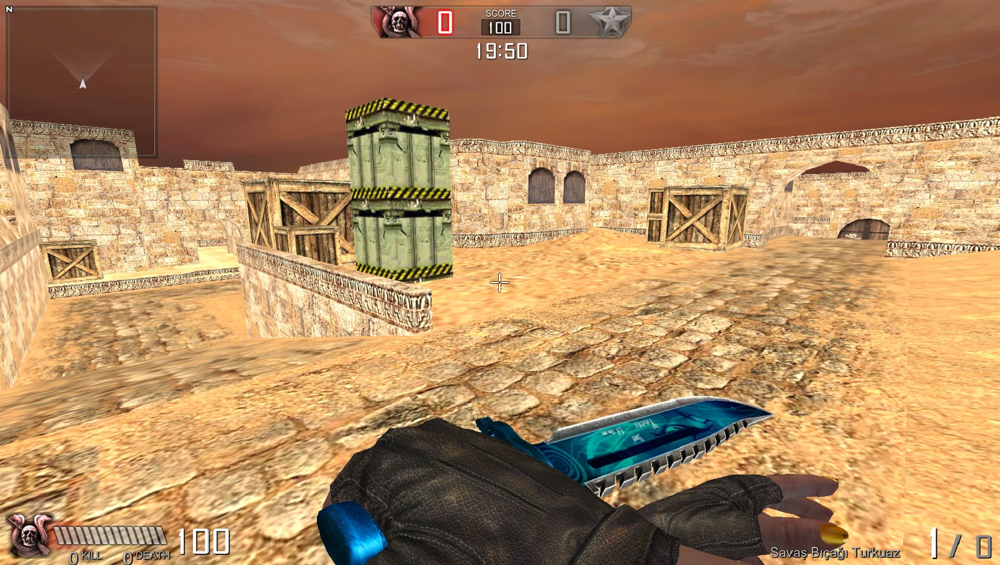
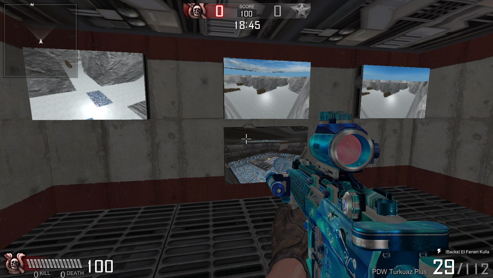
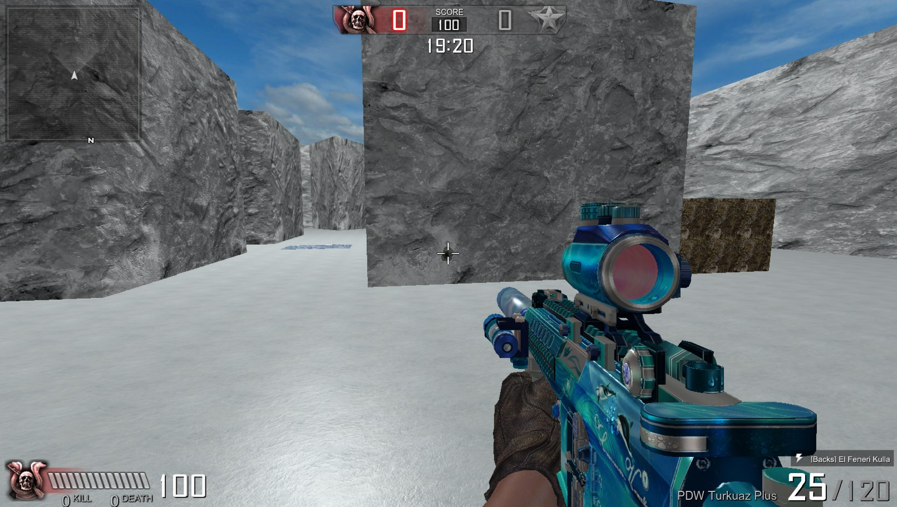
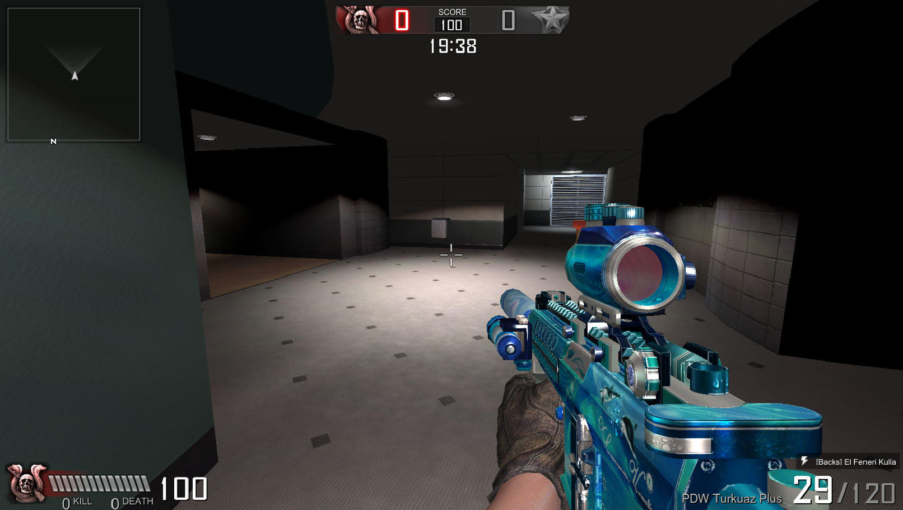
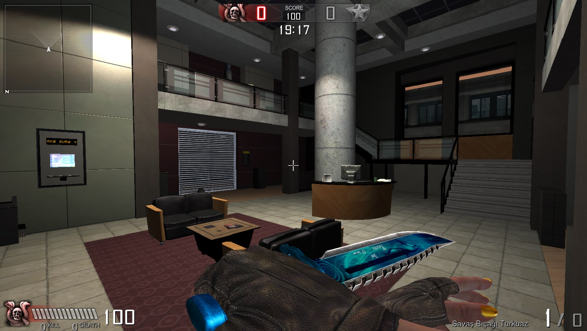
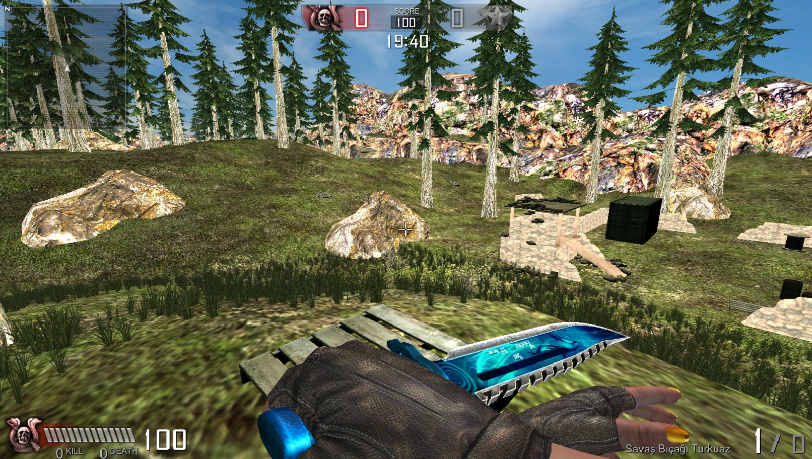
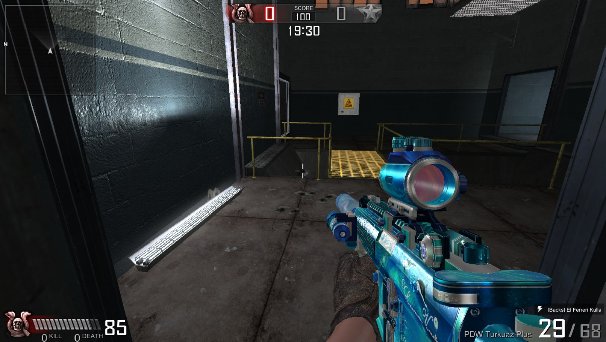
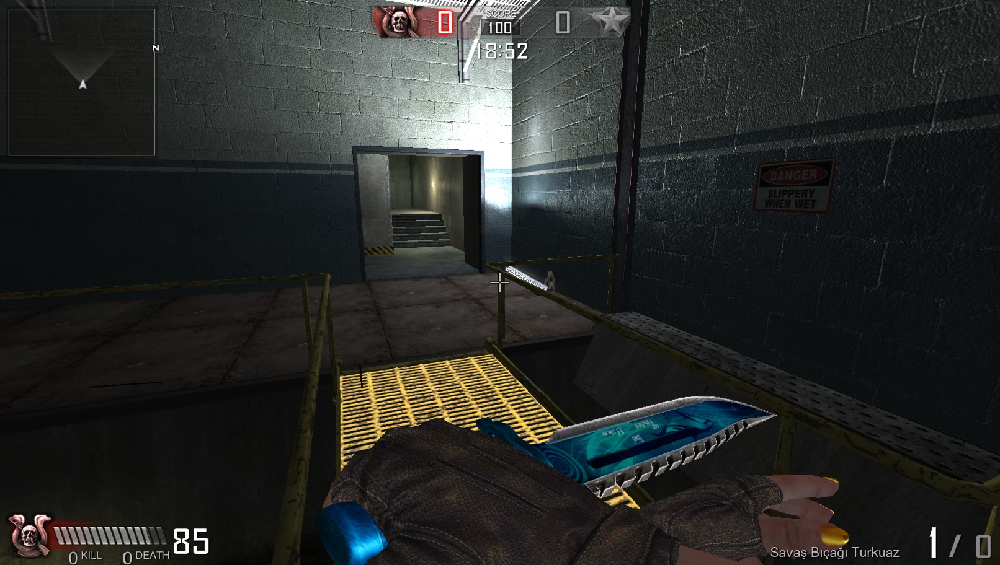
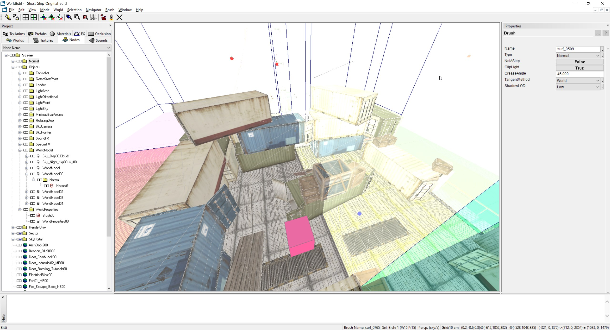

# 1WorldPacker.dll — District 187 (S2 SonSilah) World Packer

A drop-in WorldEdit packer that writes `.World00p` files in the **District 187
(D187 / S2 SonSilah)** binary format.

D187 and **F.E.A.R.** share the exact same `.World00p` layout — header, world
models, render, sector, object, and blind-object sections are all byte-identical.
The single difference is the magic XOR value applied to the 8 count `u32`s in the
`WorldModelsSection` header:

| Format | Magic |
| ------ | ----- |
| F.E.A.R. | 399 |
| D187     | 246 |

## Showcase

Worlds packed with `1WorldPacker.dll` running live in S2 SonSilah (D187):

<table>
  <tr>
    <td align="center" width="33%"><br><sub>Dust2</sub></td>
    <td align="center" width="33%"><br><sub>Iceworld</sub></td>
    <td align="center" width="33%"><br><sub>Iceworld</sub></td>
  </tr>
  <tr>
    <td align="center" width="33%"><br><sub>Cafeteria</sub></td>
    <td align="center" width="33%"><br><sub>Cafeteria</sub></td>
    <td align="center" width="33%"><br><sub>Deadwood</sub></td>
  </tr>
  <tr>
    <td align="center" width="33%"><br><sub>Rafinery</sub></td>
    <td align="center" width="33%"><br><sub>Rafinery</sub></td>
    <td align="center" width="33%"><br><sub>WorldEdit packing</sub></td>
  </tr>
</table>

## Install

1. Download the **F.E.A.R. SDK tools**.
2. Locate the packers folder:

   ```
   \Dev\Tools\Packers
   ```

3. Copy `1WorldPacker.dll` into that folder, **keeping the same filename** as the
   packer it replaces (overwrite the existing F.E.A.R. packer of that name).

## Use

1. Open **WorldEdit**.
2. Run **WinPacker** to pack your world.

The packer produces a `.World00p` that loads directly in **S2 SonSilah (District
187)**.

## Converting an existing F.E.A.R. world

If you already have a packed F.E.A.R. `.World00p` and just want it to load in
D187, you don't need to repack — re-encode the magic in place with the included
script:

```bash
python convert_fear_to_d187.py <input.World00p> <output.World00p>
```

This reads the 8 `WorldModelsSection` counts under the F.E.A.R. magic (399) and
rewrites them under the D187 magic (246). Every other byte is left untouched.

The script validates that the input is a real F.E.A.R. world (version `113`, with
plausible decoded counts) before writing, so it will refuse non-Fear input rather
than corrupt it.

## License

[MIT](LICENSE) © leftspace89
